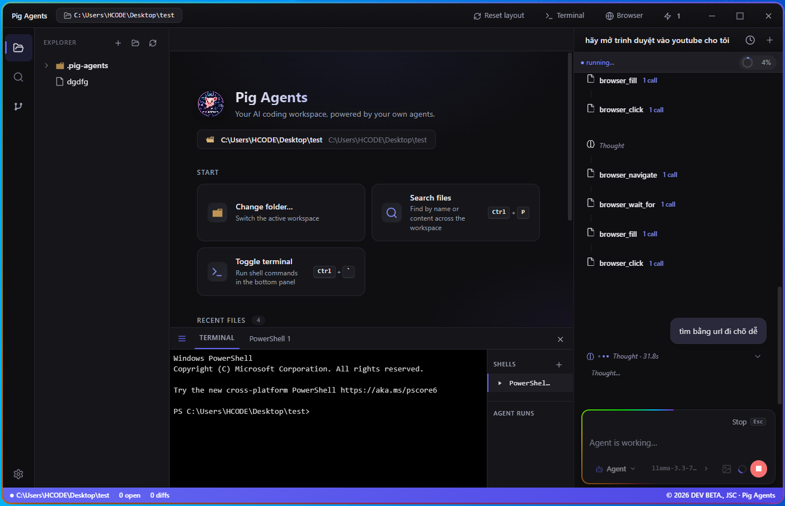

# Pig Agents Desktop


Native IDE + AI agent for **Windows** (first), **Linux**, and **macOS**.

**Start here:** [`PLAN.md`](PLAN.md) — master plan (phases, gates, timeline).

This repository is **independent** from `pig-agents-web/`. Do not copy or patch files from the web project; reimplement features here against the rules in `AGENTS.md` and `.cursor/rules/`.

## Architecture

```text
app/
  core/       Node logic (agent, tools, FS) — no HTTP, no Playwright
  electron/   Main process, IPC, BrowserView, PTY
  renderer/   React UI — talks only via preload IPC
```

- **No** Express, Vite dev proxy, or browser-hosted backend.
- **No** Playwright / remote screencast browser.
- Embedded browsing uses Electron `BrowserView` + `webContents`.

## Features

**AI agent**
- ReAct agent loop with streaming, parallel tool dispatch.
- **Parallel sub-agents** — the agent can fan out independent read-only
  sub-tasks via `spawn_subagents` and aggregate their results
  (see [`docs/parallel-subagents-design.md`](docs/parallel-subagents-design.md)).
- Vision: attach images in chat and the model sees them (provider-dependent).

**LLM providers** (Settings → LLM Provider)
- OpenAI-compatible clouds (ChatGPT, Gemini, OpenRouter, Claude API, DeepSeek,
  Groq, Mistral, …), **Cursor** Cloud Agents, **Ollama** (local), and a custom
  base URL.
- **Claude Code (SDK)** — runs Claude Code headlessly via
  `@anthropic-ai/claude-agent-sdk`. Leave the API key empty to use your local
  `claude login` subscription, or paste an Anthropic key to bill via the API.
  No base URL; the model list (e.g. *Sonnet 4.6*, *Opus 4.8*) is fetched live
  from the SDK.

**Editor** (Monaco)
- Syntax highlighting + IntelliSense for web languages.
- **Format Document** (Prettier, offline) — `Shift+Alt+F` / `Ctrl+Shift+I` /
  right-click — for JS/TS/JSON/HTML/CSS/SCSS/LESS/Markdown/YAML.
- **Image viewer** — open `.png/.jpg/.svg/.gif/.webp/…` to preview in the editor.
- **Markdown** — open `.md` with a Cursor-style **Preview ⇆ Source** toggle.
- **Explorer** updates in real time (recursive FS watcher) like VS Code.

**Chat**
- **Edit a past message in place** (Cursor-style) — click a message to open the
  composer inline; add/remove/paste images, then re-run.
- **Re-run / Edit-and-re-run / Restore** all roll the chat *and* the workspace
  back to the turn's pre-run checkpoint (reversible).

## Prerequisites

- Node.js 20 LTS (64-bit)
- Windows 10/11 for primary development
- Visual Studio Build Tools (for `node-pty` on Windows) when enabling terminals

## Configuration

| What | Where |
|------|--------|
| LLM provider, model, API keys | **Settings** in the app (saved automatically) |
| Runtime `.env` | `%APPDATA%\Pig Agents\.env` on Windows (`PIG_ENV_FILE` in main) |
| Per-provider API keys | `llm-profiles.json` under userData (managed via Settings) |

## Security before `npm install`

Read [`docs/SECURITY.md`](docs/SECURITY.md) and [`docs/DEPENDENCIES.md`](docs/DEPENDENCIES.md). New packages require approval and a lockfile update.

```bash
npm install
npm run dev
```

## App icon

Source: project root `icon.png` (1024×1024). Copies used by the app:

| Path | Use |
|------|-----|
| `app/electron/resources/icon.png` | Electron window / installer (`electron-builder`) |
| `app/renderer/public/icon.png` | Dev UI favicon |

After replacing `icon.png`, copy it to both paths above (or re-run your asset sync).

## Scripts

| Script | Purpose |
|--------|---------|
| `npm run dev` | Electron + Vite renderer (HMR) |
| `npm run build` | Production bundles |
| `npm run package:win` | NSIS installer (Windows x64) |

## Reference only

`pig-agents-web/` may sit beside this repo for product ideas. **Do not import or symlink its source into `app/`.**
